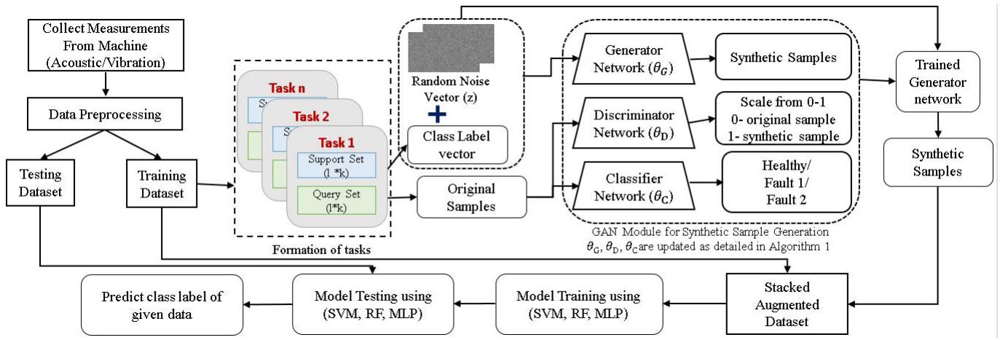
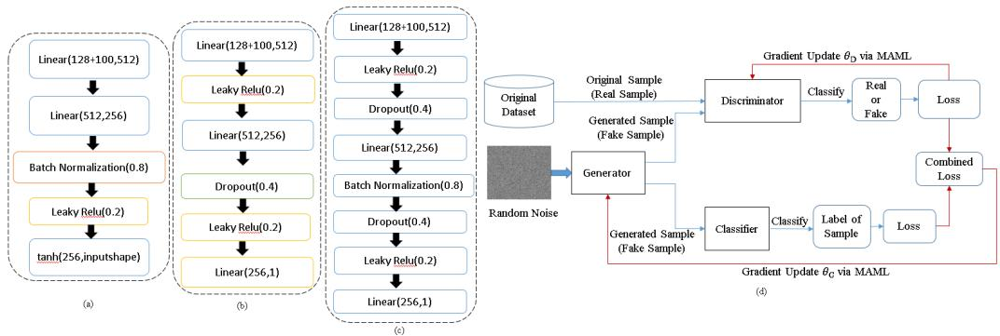
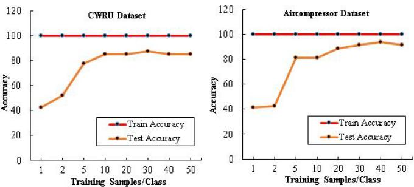
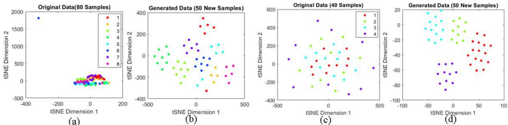
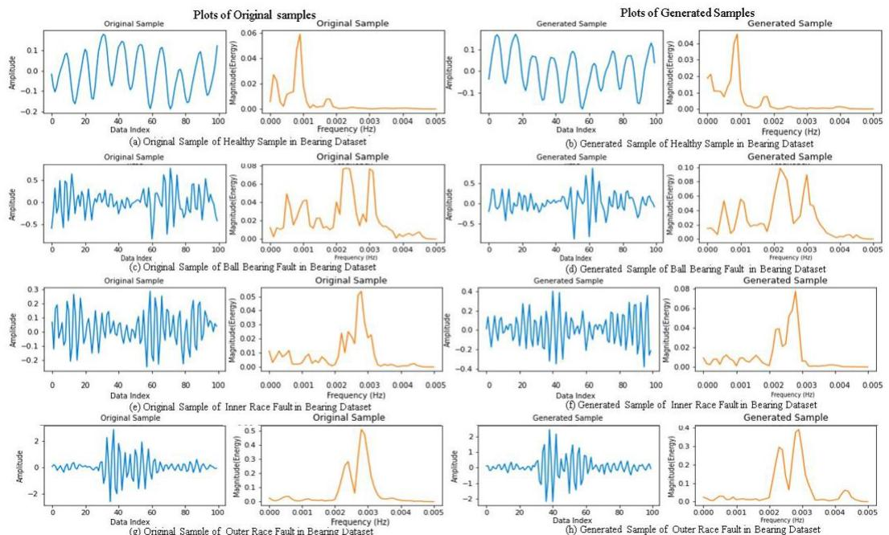
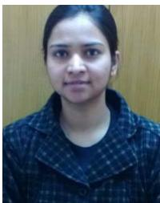

# Intelligent Fault Diagnosis of Rotary Machines: Conditional Auxiliary Classifier GAN Coupled With Meta Learning Using Limited Data

Sonal Dixit , Graduate Student Member, IEEE, Nishchal K. Verma , Senior Member, IEEE, and A. K. Ghosh , Senior Member, IEEE

Abstract— The industrial advancement has promoted the development of deep learning (DL)-based intelligent fault diagnosis methods for condition-based maintenance (CBM). Though these methods rely on large dataset for training, the collection of large number of fault samples is not practically feasible. For this purpose, generative adversarial networks (GANs) are capable to generate high-quality synthetic samples. However, the problem still persists with the training of GAN using limited fault samples that are present in practical conditions. This article proposes a novel conditional auxiliary classifier GAN framework coupled with model agnostic meta learning (MAML) to resolve this problem. The objective is to initialize and update the network parameters using MAML instead of regular stochastic gradient learning. This modification enables GAN to learn the task of synthetic sample generation using the limited training dataset. The effectiveness of the proposed framework has been compared with several famous state-of-the-art intelligent fault diagnosis methods existing in the literature. The comparative performance has been validated on benchmarked datasets, i.e., air compressor and bearing datasets collected from a single-stage reciprocating air compressor. The proposed framework is able to achieve the classification accuracy of $9 9 . 2 6 \%$ and $9 8 . 5 5 \%$ for bearing and air compressor datasets, respectively, with only ten samples per class. Moreover, a real-time case study is performed to validate the proposed method in real time.

Index Terms— Classification, condition-based maintenance (CBM), fault diagnosis, generative adversarial network (GAN), limited fault samples, meta learning, model agnostic meta learning (MAML).

# NOMENCLATURE

ACGAN Auxiliary GAN.   
ACGAN Auxiliary classifier GAN.   
CBM Condition based maintenance.   
CGAN Conditional GAN.   
CACGAN Conditional ACGAN.   
CDCGAN Conditional deep convolutional GAN.   
CNN Convolutional neural network.   
GAN Generative adversarial networks.

Manuscript received April 10, 2021; accepted May 6, 2021. Date of publication May 20, 2021; date of current version June 8, 2021. The Associate Editor coordinating the review process was Dr. Zhigang Liu. (Corresponding author: Sonal Dixit.)

Sonal Dixit and Nishchal K. Verma are with the Department of Electrical Engineering, Indian Institute of Technology Kanpur, Kanpur 208016, India (e-mail: sonaldixit07 $@$ gmail.com).

FLOP Floating point operations per second.   
MAML Model agnostic meta learning.   
MLP Multilayer perceptron.   
RF Random forest.   
SVM Support vector machine.   
SMOTE Synthetic minority oversampling technique.   
WDCNN Deep convolution neural networks with wide first-layer kernels.   
VAE Variational autoencoder.   
WGAN Wasserstein GAN.   
WGAN-GP Wasserstein GAN with gradient penalty.

# I. INTRODUCTION

N RECENT years, maintenance paradigms in industries I have shifted from corrective to condition-based maintenance (CBM), where intelligent fault diagnosis plays a significant role. CBM of rotary machines includes early detection of faults based on machine condition and taking required action for maintenance [1]. Sudden breakdown of these machines not only causes huge economic and production loss but also risks human life. Therefore, the development of intelligent fault diagnosis methods has become very important for reliable and safe operation of machines [2]. Here, intelligent keyword refers to the artificial intelligence methods, i.e., artificial neural networks (ANNs), support vector machine (SVM), fuzzy systems (FSs), and deep learning (DL). Among these, DL-based intelligent fault diagnosis methods have received much attention in last few years due to their powerful representation capability and ability to handle large data. According to literature survey [3], [4] in last five years, more than 500 articles have been published in which DL methods are applied for health assessment, prediction [5]–[8], and monitoring of machine components ranging from bearing [9] to train bogie [10]. One of the primary assumption of these methods is that large labeled data are available to build a fault diagnosis model [11]. Another assumption is that machine operating conditions are stationary [12]. In the real-time scenario, the availability of a large training dataset in the stationary condition is not practical due to many reasons such as: 1) running of faulty machine is not safe, and therefore, installed data acquisition system can record very few samples, and 2) in real time, during machine operation load, rotating speed, pressure, and temperature, keep changing, and therefore, collection of samples in one specific condition is limited. Now, the challenge is to develop a novel fault diagnosis framework, which can efficiently train even in the presence of limited training samples.

In the literature, researchers have proposed various approaches to deal with the issue of limited fault data. The most commonly used approach is data sampling. As the name suggests, data sampling is performed to deal with the imbalanced data where classes with a large number of samples are reduced using the undersampling, whereas classes with few samples are increased by oversampling as needed. Another method of sampling is synthetic minority oversampling technique (SMOTE) [13] where new sample point is generated via interpolation between existing data samples and their nearest neighbors. Although these methods [14] have obtained good performance, they still have some drawbacks that are as follows.

1) Lack of Adaptability: These methods are unable to learn the data distribution characteristic of samples.   
2) Linear Mapping: The mapping process from original to synthetic samples is linear, and therefore, the distribution of original data cannot be mapped well.   
3) Information Loss: In the case of undersampling, some information might be lost.

Few researchers have also explored the usages of transfer learning. The basic concept is to transfer knowledge acquired from one problem to resolve another problem where both problems have a degree of resemblance. Chen et al. [15] developed a DL-based transfer learning model where features can be extracted from very limited data. Cao et al. [16] proposed a gearbox fault diagnosis method by transferring the knowledge of pretrained convolutional neural network (CNN) parameters to fine-tune another untrained network with a fully connected layer followed by an SVM classifier. Liu et al. [17] proposed TScatNet a cross-domain intelligent fault diagnosis model for bearing. The main constraint with these methods is that a sufficient number of samples are needed for pretraining of the base model.

Considering the limitations of aforementioned methods, an intelligent method is required, which can resolve the issue of limited data without adding more complexity and need of pretraining. This method should be able to build an effective classifier model. If synthetic samples are added, they should be similar to the original ones. In the literature, generative networks, such as variational autoencoder (VAE) and generative adversarial networks (GANs) [18], have shown promising results in generating high-quality images, text translations, and speeches. In the context of fault diagnosis, these methods have been explored and reported in [19]–[21] and [22]. Li et al. [20] proposed, i.e., Wasserstein GAN with gradient penalty (WGAN-GP) where high-quality samples are generated to boost the fault diagnosis accuracy for imbalanced training dataset. Zhang et al. [21] proposed a network where synthetic samples were generated using the sliding window with overlap. It utilizes deep convolution neural networks with wide first-layer kernels named (WDCNN) to suppress noise in input, and for domain adaption purpose, adaptive batch normalization was implemented. In another approach [22], a siamese neural network-based framework is proposed in which feature vector is extracted using the WDCNN network. The proposed method achieved an accuracy of $8 8 . 4 1 \%$ with 90 training samples. Luo et al. [23] proposed a conditional deep convolutional GAN (CDCGAN) to deal with limited and imblanced bearing and gearbox fault diagnosis dataset.

These GAN networks try to learn the distribution of original data fed to them and generate synthetic samples. Motivated by this, a GAN-based network was opted to resolve the issue of limited dataset. In the proposed framework, we are using GAN as a synthetic data generation module for data augmentation purpose. It is more scaled, adaptive and nonlinear in nature compared to sampling-based methods. However, it noticed that for better training of GAN networks, balanced and large dataset are required, which is contrast to the real-time condition. In the industrial system, it is hard to collect samples from fault condition because running of faulty machine may have hazardous consequences. Further to resolve this issue, meta learning was adopted. Model agnostic meta learning (MAML) [24] has been recently introduced for fast adaption of deep neural networks. The main advantage of using MAML over other methods, such as metric learning and matching networks, is as follows: 1) simple yet effective gradient-based optimization approach; 2) it does not require any additional parameters or model modification; and 3) applicable to a large set of models where gradient estimation is performed.

Contributions: Inspired from above, in this research work, we propose a novel intelligent fault diagnosis method based on advanced GAN, i.e., conditional auxiliary classifier GAN for generating synthetic samples. The advantage of using conditional GAN (CGAN) over simple GAN is that it tries to learn the marginal probability distributions that are useful to estimate the distributions of all classes and addition of auxiliary classifier network helps the generator network to generate better samples. Here, CACGAN is trained using a meta-learning algorithm. It enables fast adaption of network parameters, which helps to learn sample generation with limited data. The proposed methodology can also be viewed as novel data augmentation approach in which the proposed CACGAN will generate synthetic samples. These samples will be augmented with original ones to increase the total number of training samples in dataset so that classifier can generalize well and improves the classification accuracy. To summarize, the significant contributions of our research are presented as follows.

1) We have proposed a novel fault diagnosis method based on conditional auxiliary classifier GAN coupled with MAML to deal with the constraints of very few samples. It can also be viewed as a novel data augmentation method for fault diagnosis of rotary machines with limited data.   
2) The proposed framework allows synthetic data generation by learning distribution from very few original samples, a novel method of data augmentation in the context of fault diagnosis. This framework combines the

advantages of MAML into GAN to reap the full benefits of generative network.

3) Experiments on benchmark rotary machine datasets, i.e., bearing [25] and air compressor [26], validate the effectiveness of our approach. The proposed approach is not constrained by the type of signal present in dataset; it is validated on vibration as well as acoustic data. Even with very few samples per class, i.e., five and ten, good classification accuracy has been achieved. In addition, a case study has also been investigated to show the effectiveness of the proposed approach in real time.

The rest of this article is organized as follows. Section II details the necessary information about CACGAN and MAML. Description of our proposed intelligent fault diagnosis method is provided in Section III. Section IV gives the details of experimental studies carried out using the proposed approach. Section $\mathrm { v }$ summarizes the whole work and briefs the future scope.

# II. BACKGROUND

The proposed methodology presents a data augmentationbased approach for fault diagnosis framework to tackle the issue of limited dataset. For this purpose, advanced GAN network and MAML have been used. This section provides brief details of these methods.

# A. Conditional Auxiliary Classifier GAN

Inspired by game theory, in 2014, Goodfellow et al. [18] introduced GAN. It is proved to be the most promising approach for image generation, language translation, speech synthesis, and many more. The basic architecture of GAN includes two neural networks with contradictory objective functions. The first network termed generator $G$ tries to produce new samples also called synthetic sample similar to the original (input) sample by nonlinear mapping of random noise referred to as z. Its objective function of $G$ can be represented as

$$
\mathcal { I } ( G ) _ { \mathrm { m i n } } = \mathbb { E } _ { z \sim p _ { z ( z ) } } [ \log ( 1 - D ( G ( z ) ) ) ]
$$

where $p _ { z }$ is the data distribution over noise $z$ , $G ( z )$ is the generated synthetic sample, and $D ( G ( z ) )$ is the output of discriminator, i.e., probability over $G ( z )$ .

The second network, referred as discriminator $D$ , tries to distinguish between original samples and synthetic samples. It scales the probability of output from 0 to 1. In the ideal condition, for generated data, output should be 0, whereas for original data, it should be 1. Its objective function $\mathcal { T } ( D )$ is described as

$$
\begin{array} { r } { \mathcal { I } ( D ) _ { \operatorname* { m a x } } = \mathbb { E } _ { z \sim p _ { \mathrm { d a t a } ( x ) } } [ \log D ( x ) ] + \mathbb { E } _ { z \sim p _ { z ( z ) } } \qquad } \\ { [ \log ( 1 - D ( G ( z ) ) ) ] . } \end{array}
$$

The first term on the right-hand side of (2), $\log D ( x )$ , refers to the log likelihood of the $D$ output when the original data are fed as input to $D$ , and $p _ { \mathrm { d a t a } }$ is the distribution of original dataset. $[ \log ( 1 - D ( G ( z ) ) ) ]$ denotes the negative log likelihood of the $D$ output when the synthetic data are fed as input to $D$ .

The overall goal of GAN network is to play a min-max game where $G$ tries to fool $D$ by feeding synthetic (fake) samples as if they are original (real). On contrary, $D$ catches $G$ by correctly identifying whether given sample is real or fake. According to [27], when the labeled training data are available, it can be used by GAN subnetworks for generating better synthetic samples. The extra information of class label helps to generate samples that are class conditional. This variant of GAN is termed CGAN. Odena et al. [28] proposed a GAN architecture where additional classifier network $C$ is augmented to the basic framework termed auxiliary GAN. Classifier guides $G$ to generate synthetic samples that are distinguished enough, thus improving the quality of synthetic samples.

# B. Model Agnostic Meta Learning

The concept of meta learning is to make the model learn the given task. Finn et al. [24] introduced an optimization-based algorithm for meta learning termed MAML. The proposed MAML method can be applied to all the networks trained via gradient descent/ascent, and therefore, this method is referred as model agnostic. MAML initializes the network parameter in such a way that with very few gradient updates, network can learn new tasks; thus, learning happens with very few samples. Let us say that we have a simple feedforward neural network $f$ with $\theta$ parameters and it has to learn classification. The training of $f$ can be represented as $f _ { \theta } ( x )  y$ , where $x \ \sim \ p _ { \mathrm { d a t a } }$ . To learn $\theta$ , gradient learning is applied where loss is calculated, and with respect to its gradient parameters, $\theta$ will be updated. In case of MAML setting, learning will be represented as $f _ { \theta ^ { \prime } } ( D _ { \mathrm { m e t a t r a i n } } , x ) \to y$ , where $\theta ^ { \prime }$ is learned using MAML and $D _ { \mathrm { m e t a t r a i n } }$ is the subset of training dataset consisting of several related tasks. Each task comprises two data subsets, i.e., support set $S$ and query set $Q$ . In each of $S$ and $Q$ set, we have $k$ samples from each class similar to few shot setting [29]. Now, network is trained to learn these tasks. At first, for $n$ th task $T _ { n }$ , samples from $S$ are used to learn $\theta$ . It is called local gradient update where $\theta ^ { \prime }$ is learned and can be described as

$$
\theta _ { n } ^ { \prime } = \theta - \alpha \nabla _ { \theta } \mathcal { L } _ { T _ { n } } ( f _ { \theta } )
$$

where $\alpha$ is the learning rate and ${ \mathcal { L } } _ { T _ { n } } ( f _ { \theta } )$ is the loss for task $T _ { n }$ computed over $k$ samples in $S$ set by $f _ { \theta }$ . Once $f$ is initialized with $\theta _ { n } ^ { \prime }$ , then final $\theta$ is learned using sum of loss over $k$ samples from $Q$ . This step is termed global gradient update and can be represented as

$$
\theta = \theta - \beta \nabla _ { \theta } \sum _ { T _ { n } \sim p ( T ) } \mathcal { L } _ { T _ { n } } ( f _ { \theta _ { n } ^ { \prime } } )
$$

where $\beta$ is the learning rate, $p _ { T }$ is the task distribution, and $\mathcal { L } _ { T _ { n } } ( f _ { \theta _ { n } ^ { \prime } } )$ is the loss for task ${ \mathcal { T } } _ { n }$ calculated by $f _ { \theta _ { n } ^ { \prime } } . \ T _ { n }$ As shown in the above equation, $\theta$ update is done on the basis of $\theta _ { n } ^ { \prime }$ , and therefore, even with single gradient update, better features can be learned on query set examples. In summary, using the S, network gets prior experience where common features are learned, and then, using $Q$ , fine-tuning occurs with very few data.

# C. Need of GAN and MAML for the Proposed Framework

GAN network has already been widely adopted and used by CBM researchers as an advanced DL method [18]–[23]. CGAN helps to generate samples specific to the class label provided as input. For example, when samples of bearing fault are less in the training dataset, we would like to generate the samples of bearing fault only. Thus, CGAN has the advantage of generating specific samples over simple GAN. Now, the utility and need of the auxiliary classifier network are explained as follows. Let us say that CGAN (synthetic generation module) is to be trained for the generation of two classes, i.e., healthy and bearing. The loss for the healthy sample is represented as $l o _ { 1 }$ , whereas, for the bearing sample, it is denoted as $l o _ { 2 }$ . Now, when the input is conditional on healthy, i.e., ${ \tilde { x } } | x$ , healthy, ideal output of the generator should also be a healthy synthetic sample. However, based on the training, generator may output synthetic sample either of healthy or bearing. Since the discriminator is only able to distinguish between real versus fake, therefore, for any output (bearing or healthy), loss for the discriminator will be the same, i.e., $l o _ { 1 } = l o _ { 2 }$ . Therefore, despite incorrect generation, generator is not going to be penalized. To tackle this issue, an auxiliary classifier has been added to the GAN network. The addition of auxiliary classifier output of the generator is also passed to the classifier where it tries to distinguish between healthy and faulty, i.e., bearing fault sample and penalizes in case it generated the wrong type of sample. Thus, generator training is improved only if synthetic generated samples are of the correct class. Since GAN is an advanced DL model, we cannot deny that it requires large data for training, whereas we are constrained by training data size. Therefore, we have introduced MAML that can learn optimal network parameters with a less number of training samples. Similarly, ablation experiments have been conducted, and the results have been included in Table II, which further validates our findings.

# B. Data Acquisition and Preprocessing

To build the fault diagnosis model, machine parameters are measured, and the dataset is formed. This step is referred to as data acquisition. Since in this research work, benchmark datasets have been used, and therefore, the acquisition procedure is not covered here in detail. Section IV gives a brief detail about these datasets. For preprocessing purpose, segmentation and normalization are performed. At the time of data collection, a sampling rate is decided on the basis of machine and sensors characteristics. Due to the variable sampling rate, collected data may have single dimension or multidimension. For example, each sample of bearing comprises 12 510 data values, whereas each sample of air compressor comprises $5 * 5 0 0 0 0$ data values. Therefore, two different schemes have been adopted for segmentation purpose as mentioned in the following.

1) For Single Dimension: In the bearing dataset, sliding window is used. In this approach, a subsample of window size $\tau$ is sliced from the total sample of length $\eta$ to create new segmented samples. Then, by taking a step size of $\eta$ , another subsample is taken from the total sample. This process is done over all the points in samples. Thus, the total number of samples will be $\left\lfloor \left( \eta - \tau / \delta \right) \right\rfloor + 1$ .

2) For Multidimension: A windowing average method has been used for air compressor dataset. In the same manner, sample is segmented, but instead of variable window size, a fixed window has been used. For each sample, a window of fixed size is rolled over and all points inside the window are replaced by its mean value. As a result, $\textstyle ( 1 / \tau ) \sum _ { i = 1 } ^ { \tau } r _ { i }$ number of samples are obtained from the original sample.

Once samples are segmented, an input matrix is obtained on which standard min-max normalization is applied.

# III. PROPOSED METHODOLOGY

The standard procedure of fault diagnosis model comprises five steps: 1) data acquisition; 2) preprocessing; 3) feature extraction and selection; 4) model training; and 5) model testing. In our proposed methodology, one more step has been added where, before model training, synthetic samples were generated so that training size can be increased. The framework of whole fault diagnosis process is shown in Fig. 1. The details of each step have been provided after the following section.

# A. Problem Formulation

We have a dataset $\mathrm { D S } ~ = ~ \left( \mathrm { D S } _ { \mathrm { t r } } , \mathrm { D S } _ { \mathrm { t e } } \right)$ where both $\mathrm { D S } _ { \mathrm { t r } }$ and $\mathrm { D S } _ { \mathrm { t e } }$ comprise $( x _ { i } , y _ { i } ) _ { i = 1 } ^ { N }$ and $N$ is very small. Now, the problem is how to build a reliable fault diagnosis model using limited $\mathrm { D S } _ { \mathrm { t r } }$ samples. To resolve this issue, the size of $\mathrm { D S } _ { \mathrm { t r } }$ is increased by augmenting it with synthetic dataset $\mathrm { D S } _ { \mathrm { s y } }$ . This new dataset is referred as ${ \mathrm { D S } } _ { \mathrm { a u g } }$ . To generate $\mathrm { D S } _ { \mathrm { s y } }$ a GAN-based network has been developed, which tries to learn the distribution of original data $\mathrm { D S } _ { \mathrm { t r } }$ using very few samples in hand.

# C. Overall Architecture of CACGAN Model (Synthetic Sample Generation Module)

In the proposed methodology, the network adopted for synthetic data generation is termed CACGAN network where MAML-based training is used for learning with limited data. As discussed in Section II, our generative framework comprises three feedforward neural networks: 1) generator $G$ ; 2) discriminator $D$ ; and 3) classifier $C$ . Each network has sequential model where linear layers are used for input data processing followed by normalization, dropout, and relu layer, as shown in Fig. 2. The batch normalization layer normalizes the output of previous layer before passing it to the next layer. The role of dropout layer is to activate a certain part of neurons at a time. Both layers are introduced to achieve better training. CACGAN where the addition of labeled information and $C$ helps in improving the quality of synthetic sample generation. Let $\theta _ { G }$ , $\theta _ { D }$ , and $\theta _ { C }$ denote the parameters of $D$ , $G$ , and $C$ , respectively. These parameters are updated using the MAML-based optimization process as described in the next section.

  
Fig. 1. Proposed fault diagnosis procedure.

  
Fig. 2. Network architecture of CACGAN modules. (a) Generator architecture. (b) Discriminator architecture. (c) Classifier architecture. (d) Training steps.

D. Generation of $D S _ { a u g }$ Dataset Using CACGAN-Coupled MAML

This is the main part of our methodology in which CACGAN is trained using MAML. It can also be referred as training of synthetic sample generation module. This is an additional step in the standard fault diagnosis model where the size of the training set is increased. This process is detailed as follows.

1) Division of Dataset $D S _ { t r }$ Into Tasks: As detailed in Section II-B, MAML learns over a distribution of task $\tau$ . For generative network, task can be defined as generation of synthetic samples by learning distribution of very few examples. Here, from $\mathrm { D S } _ { \mathrm { t r } }$ , a number of tasks are sampled and batches are formed, as shown in Fig. 1.

2) Training of Synthetic Sample Generation Module: As described in Algorithm 1, first inner loop will run where pair from $S$ set of I/O, i.e., $( x _ { n } ^ { S } )$ , will be used for meta training of $G , D$ , and $C$ . The simple steps of training are shown in Fig. 2(d) Therefore, at first, $G$ takes random noise $z \sim N ( 0 ; 1 )$ of batch size concatenated with the class label vector $y$ as input. $G$ produces a sample, i.e., $\tilde { x }$ similar to a real sample $x _ { n } ^ { S }$ Conditional on class and can be defined as $G : z + y _ { n } ^ { S } \to { \tilde { x _ { n } } }$ . Now, $D$ takes $( x _ { n } ^ { S } , y _ { n } ^ { S } )$ as input and evaluates loss. Once again, $D$ takes $( \widetilde { x } _ { n } , y _ { n } ^ { S } )$ and evaluates combined loss. It can be represented as

$$
\mathcal { L } _ { T _ { n } } ^ { D } = \mathbb { E } _ { T _ { n } } D \big ( \big ( x _ { n } ^ { S } , y _ { n } ^ { S } \big ) | \theta _ { D } \big ) - \mathbb { E } _ { \tilde { x } _ { n } \sim p _ { \theta _ { G } } } D \big ( \tilde { x } _ { n } , y _ { n } ^ { S } | \theta _ { D } \big )
$$

where $p _ { \theta _ { G } }$ denotes the data distribution over synthetic samples (generator output), and the first term on the right-hand side of equation denotes the loss over real sample, which should be close to 1, whereas the second term refers to the loss over synthetic samples, which should be small, i.e., close to 0. In parallel, $\tilde { x } , y$ is also fed as input to $C$ and the mean square loss is evaluated. Now, based on the feedback received from the $D$ and $C$ network, the objective of $G$ is formed. It can be represented as

$$
\begin{array} { r } { \mathcal { L } _ { T _ { n } } ^ { G } = \mathbb { E } _ { z \sim \mathcal { N } ( 0 , 1 ) } D \big ( G \big ( y _ { n } ^ { S } , z | \theta G \big ) , y _ { n } ^ { S } | \theta _ { D } \big ) + C \big ( y _ { n } ^ { S } | \tilde { x } , \theta _ { C } \big ) . } \end{array}
$$

This objective needs to be minimized $G ( y _ { n } ^ { S } , z | \theta _ { G } )$ that should be such that loss of $G$ and $C$ should be small and $D$ loss can be large. Now, $\theta$ is calculated as mentioned in Section II-B (3) using gradient of loss defined by (5) and (6) for all $k$ samples. Thus, the step of local gradient update is done. Next, in the same way using (5) and (6), loss will be estimated, but data from $Q$ set for task $T _ { n }$ , i.e., $x _ { n } ^ { Q }$ and $y _ { n } ^ { Q }$ will be used. Here, the total loss of each task is combined after certain epochs, and then, final $\theta$ is updated; therefore, it is also termed global gradient update. The main advantage of global gradient update is that it extracts the common characteristics of tasks. Furthermore, it helps finding the optimal value of $\theta$ , which ensures strong generalization on given set of tasks via minimizing the total loss. The whole procedure of training has been summarized in Algorithm 1.

Algorithm 1 MAML Training of the Proposed CACGAN   

<table><tr><td>Input:Meta training set, Support Set, Query Set. Initialize the network parameters0g，0D,and 0c Sample a batch of tasks fromDStr where each task Tn y9). while not converged do do for each task Tn in Batch do Sample zn from N(O,1) and select x&quot;，yn from S set. Estimate the LD,Lg and Lc eq. 5 and 6,respectively.</td></tr><tr><td>Compute the gradient of each Vg，VD,Vc. Compute the adapted network parameters via gradient ascent step for D. ~(0D） Compute the adapted network parameters via gradient descent step for G,C. 0G=0-aVl end for</td></tr><tr><td>Update the G, D， C network objective function w.r.t. the x， vQ 0D=0-βVθD∑(x，y）~Tn Le a(0) 0G=0-βVθ∑(x,y~Tn C （G）</td></tr></table>

3) Synthetic Sample Generation: Once the generative network is trained, the $G$ network is used and the rest all are made constant. A batch of random noise and specified class vector is passed to the trained $G$ network. It provides synthetic samples of all the required classes. Thus, ${ \mathrm { D S } } _ { \mathrm { a u g } }$ is formed by stacking $\mathrm { D S } _ { \mathrm { t r } }$ and generated synthetic samples.

# E. Model Training and Testing

Now, the ${ \mathrm { D S } } _ { \mathrm { a u g } }$ dataset is formed, which can be used by any standard classifier algorithm, i.e., SVM, random forest (RF), and multilayer perceptron (MLP) to train the fault diagnosis model. Once the model is trained, we evaluate its efficiency on ${ \mathrm { D S } } _ { \mathrm { t e s t } }$ . The whole fault diagnosis procedure using the proposed network can be summarized in the following steps.

1) Step 1: Preprocessing of the dataset, which includes segmentation and normalization of samples as detailed in Section 3.1.   
2) Step 2: Division of dataset into training and testing set.   
3) Step 3: Train the CACGAN via MAML-based adversarial training of $G$ and $C$ .   
4) Step 4: Using the trained generative network synthetic samples that are generated and classes are labeled.   
5) Step 5: Train your classifier model with augmented dataset.   
6) Step 6: Test the accuracy of classifier model on testing dataset.

# IV. EXPERIMENTS AND RESULTS

This section details the benchmark datasets, their preprocessing, and classification results on the proposed fault diagnosis framework. It also presents the performance of the

TABLE I DATASET DESCRIPTION   

<table><tr><td>Datasets</td><td>Classes</td><td>Total Samples</td><td>Sample Size (Before preprocessing)</td><td>Sample Size (After preprocessing)</td></tr><tr><td>Bearing [25]</td><td>4</td><td>4840</td><td>12510</td><td>100</td></tr><tr><td>Air Compressor [26]</td><td>8</td><td>1800</td><td>2500K</td><td>128</td></tr></table>

proposed approach in various cases and comparative analysis with state-of-the-art methods.

# A. Datasets Description

To validate the effectiveness of the proposed framework, two benchmark datasets have been investigated, namely, air compressor dataset [26] and bearing dataset [25]. In the literature, more than 100 publications have mentioned usage of these datasets. Thus, both of them are widely accepted by CBM field researchers to validate the fault diagnosis frameworks [3]. A summary of both datasets is presented in Table I and described as follows.

1) Bearing: The Bearing dataset [25] is a real-time dataset that comprises vibration recordings taken from the bearing experimental setup at Case Western Reserve University. In our case study, data were collected when the motor was running on no load at the speed of $1 7 7 2 \mathrm { \ m m }$ , and sensors were located on the drive end of the bearing. The collected vibration measurements were recorded at the sampling rate of $1 2 ~ \mathrm { k H z }$ . Faulty bearings were installed in the motor to collect fault samples. These faults were created using electrodischarge machining at the inner raceway, rolling element (ball), and outer raceway of bearing. Thus, the bearing dataset consists of four classes: normal, ball fault, inner race fault, and outer race fault. Each sample contains approximately 12 510 data points and is further segmented using the sliding window as detailed in Section III-B to form an input matrix of size $4 8 4 0 * 1 0 0$ ; 1210 samples from each class were present. Randomly 125 samples of each class were drawn from the dataset, and training datasets of size $5 0 0 * 1 0 0$ were formed. From the remaining dataset 50, samples were randomly drawn for each class to build a testing dataset of size $5 0 * 1 0 0$ for our case study.

2) Air Compressor: This dataset is the real-time dataset that was collected in past by the Intelligent Informatics Lab (our) from a single-stage reciprocating air compressor located at the Department of Electrical Engineering Workshop. It was made publicly available on our website [26]. MATHWORKS also uses this dataset to build a DL-based fault detection model [30]. It comprises acoustic recordings of air compressor collected in eight running conditions using UTP-30 unidirectional microphones. For each condition, 225 samples were recorded at the sampling rate of $5 0 ~ \mathrm { k H z }$ for $5 \mathrm { ~ s ~ }$ . In total, this dataset consists of 1800 samples where each sample is of $2 5 0 0 ~ \mathrm { K }$ data points. Faults were incipient into the air compressor by inserting the faulty component. For example, a healthy leakage inlet valve was replaced with a faulty leakage inlet valve. Similarly, other types of faults were created in the air compressor. Furthermore, samples were segmented using the average windowing method and then normalized as detailed before. Taking one step further, fast Fourier transform was applied to the segmented data. The transformed data were divided into 128 segments where energy of each segment was computed [1]. After this step, a matrix of size $1 8 0 0 ^ { * } 1 2 8$ was obtained as input for further processing. For experiment purpose, the training and testing datasets were formed by randomly selecting 50 and 80 samples, respectively, from each class.

TABLE IICLASS IFICATION ACCURACY $( \% )$ ) OF THE PROPOSED METHODOLOGYUSING DIFFERENT GAN VARIANTS  

<table><tr><td>Dataset</td><td>No. Samples</td><td>GAN [18]</td><td>CGAN [24]</td><td>WGAN [32]</td><td>CGAN+MAML</td><td>ACGAN+MAML</td><td>Proposed</td></tr><tr><td>Bearing [31]</td><td>20</td><td>87.78 ± 1.72</td><td>94.78 ± 1.56</td><td>89.78 ± 0.56</td><td>94.99 ± 1.50</td><td>95.00 ± 0.40</td><td>97.78 ± 1.02</td></tr><tr><td>Bearing [31]</td><td>40</td><td>90.17 ± 0.98</td><td>96.43 ± 1.2</td><td>94.00 ± 0.12</td><td>96.60 ± 0.95</td><td>97.43 ± 0.49</td><td>99.17 ± 0.80</td></tr><tr><td>Air Compressor [30]</td><td>20</td><td>95.78 ± 1.90</td><td>98.18 ± 1.00</td><td>97.56 ± 0.16</td><td>98.00 ± 1.00</td><td>98.95 ± 1.20</td><td>98.89 ± 1.88</td></tr><tr><td>Air Compressor [30]</td><td>40</td><td>96.78 ± 1.02</td><td>98.49 ± 1.50</td><td>97.78 ± .08</td><td>98.40 ± 1.00</td><td>98.50 ± 1.06</td><td>97.99 ± 0.24</td></tr></table>

# B. CACGAN Parameter Selection and Training

The selection of all CACGAN parameters was performed by experimentation. The number of layers in generator, discriminator, and classifier network was varied from (3, 4, 5). Furthermore, the number of nodes in discriminator and generator was changed from 512 to 256. In case of classifier network, a number of nodes were kept 75, 25. Learning rate parameter of discriminator and generators was varied from $_ { 2 \mathrm { e } - 6 }$ to 5e−6. For training of CACGAN, alternatively generator and discriminator were trained. Classifiers network was updated during generator’s training. Mean square loss is opted for loss function of these networks. For generator loss, combined loss of classifier and discriminator is used. Discriminator loss is computed by combining loss on real and synthetic samples. After five epochs of discriminator training, one epoch of generator is executed. Classifier updates its parameters during training of generator only.

For implementing MAML update, the training set is configured as tasks. In our case study, the number of tasks was set to the number of classes and half of these were used as support set and half were used as query set.

# C. Selection of GAN Architecture

This study was performed to validate the selection of proposed CACGAN architecture and MAML in the proposed fault diagnosis framework. For this purpose, five GAN variants, namely GAN, CGAN, Wasserstein GAN (WGAN), auxiliary GAN (ACGAN), and CACGAN (our), have been compared. Besides, CGAN and ACGAN with MAML are also compared, as shown in Table II. Classification accuracy is selected as a performance metric. Here, fivefold cross-validation mean accuracy is reported and the dataset was divided in the ratio of 70:30 to form the train test set. Randomly 20 and 40 samples were drawn from the dataset to form two case studies. In the case of the bearing dataset, when 20 samples were used for training the generative network, GAN is giving the lowest accuracy of $8 7 . 7 8 \%$ , whereas CACGAN (our) is reporting the accuracy of $9 7 . 7 8 \%$ . The classification accuracy was increased as the number of training samples was increased from 20 to 40. It is observed that the addition of MAML improves the accuracy. The classification accuracy of the WGAN network is showing the least standard deviation; it means that generated samples are consistent. Overall, the proposed CACGAN gives higher accuracy for both the datasets compared with other variants.

  
Fig. 3. Classification accuracy using augmented dataset where samples are generated with varying training inputs passed to the proposed generative network.

# D. Varying Number of Input Training Samples

This case study is aimed at investigating the performance of synthetic data generation module, i.e., CACGAN coupled with MAML when limited samples are passed to the network. For this purpose, a number of training samples were varied from 1, 2, 5, 10, 20, 30, 40, and 50 samples per class. The number of synthetic samples added to the original data was kept constant as 20. For example, ten samples per class were drawn from the bearing dataset, and then, CACGAN was trained. After that, a trained generator network generated 20 synthetic samples. These samples were stacked into original ten samples per class. For classification purpose, support vector machine with radial basis function is used and mean accuracy for five-fold cross-validation set is shown in Fig. 3. In the case of the bearing dataset, accuracy rises from $42 \%$ to $79 \%$ as the number of samples is increased from one to five. With 40 samples per class, i.e., 160 samples, the highest testing accuracy of $84 \%$ was reported in case of bearing dataset. With the air compressor dataset using five samples per class, only we have achieved an accuracy of $82 \%$ , whereas with 40 samples per class gives the highest testing accuracy $9 7 . 7 8 \%$ . In case of both datasets, the training accuracy was $100 \%$ as expected due to overfitting with a limited number of samples. It is observed that in few cases, training accuracy got decreased instead of increasing. It is due to the random selection of originals samples from the dataset. There are cases when chosen samples are not good enough, leading to the degraded performance of the fault diagnosis framework. Based on the experimental results, it can be concluded that when a generative network is trained with more samples, better synthetic samples are generated; thus, a better classifier model is trained.

# E. Varying Number of Data Augmentation Samples

The objective of this study is to determine the effect of augmentation on the original dataset. For this purpose,

TABLE III CLASS IFICATION ACCURACY $1 N \%$ ) USING ORIGINAL DATASET VERSUS AUGMENTED DATASET ON THE BEARING DATASET   

<table><tr><td></td><td colspan="3">Original Dataset</td><td colspan="10">2*Samples</td><td colspan="3"> 5*Samples</td></tr><tr><td> No. of Samples</td><td>RF</td><td>MLP</td><td>SVM</td><td>RF</td><td>MLP</td><td>SVM</td><td>RF</td><td>3*Samples MLP</td><td>SVM</td><td>RF</td><td></td><td>4*Samples MLP</td><td>SVM</td><td>RF</td><td>MLP SVM</td></tr><tr><td>5*4=20</td><td>50</td><td>36.67</td><td>33.33</td><td>46.67</td><td>57.78</td><td>46.67</td><td>52.73</td><td>60.00</td><td>76.36</td><td>63.33</td><td>60.00</td><td>71.67</td><td>77.14</td><td>75.71</td><td>95.71</td></tr><tr><td>10*4=40</td><td>55.00</td><td>41.67</td><td>53.33</td><td>71.11</td><td>62.22</td><td>70.00</td><td>76.19</td><td>73.33</td><td>86.67</td><td>82.50</td><td>80.00</td><td>92.50</td><td>83.70</td><td>74.07</td><td>99.26</td></tr><tr><td>15*4=60</td><td>65.56</td><td>57.78</td><td>93.33</td><td>77.78</td><td>62.96</td><td>94.81</td><td>86.25</td><td>73.75</td><td>99.38</td><td>88.89</td><td>80.00</td><td>99.44</td><td>83.90</td><td>75.61</td><td>99.02</td></tr><tr><td>20*4=80</td><td>75.83</td><td>69.17</td><td>99.17</td><td>82.22</td><td>78.89</td><td>99.44</td><td>86.67</td><td>81.90</td><td>99.05</td><td>88.33</td><td>83.75</td><td>99.17</td><td>90.74</td><td>87.78</td><td>98.89</td></tr><tr><td>25*4=100</td><td>83.33</td><td>63.33</td><td>98.67</td><td>86.22</td><td>71.56</td><td>97.33</td><td>87.55</td><td>75.09</td><td>100</td><td>89.00</td><td>83.67</td><td>100</td><td>90.88</td><td>83.53</td><td>100</td></tr><tr><td>30*4=120</td><td>80.33</td><td>58.33</td><td>98.33</td><td>98.33</td><td>74.44</td><td>99.63</td><td>99.37</td><td>78.10</td><td>99.37</td><td>99.44</td><td>79.17</td><td>99.44</td><td>100</td><td>86.42</td><td>100</td></tr></table>

TABLE IVCLASS IFICATION ACCURACY $(\mathrm { I N } \% )$ ) USING ORIGINAL DATASET VERSUS AUGMENTED DATASET ON THE AIR COMPRESSOR DATASET  

<table><tr><td></td><td colspan="3">Original Dataset</td><td colspan="10">2*Samples</td></tr><tr><td>No. of Samples</td><td>RF</td><td>MLP</td><td>SVM</td><td>RF</td><td>MLP</td><td>SVM</td><td>RF</td><td>3*Samples MLP</td><td>SVM</td><td>RF</td><td>4*Samples MLP</td><td>SVM</td><td>RF</td><td>5*Samples MLP</td><td>SVM</td></tr><tr><td>5*8=40</td><td>80.00</td><td>87.67</td><td>81.33</td><td>65.33</td><td>82.00</td><td>89.53</td><td>74.12</td><td>81.18</td><td>93.76</td><td>83.33</td><td>97.78</td><td>95.89</td><td>79.00</td><td>93.00</td><td>98.54</td></tr><tr><td>10*8=80</td><td>88.17</td><td>94.50</td><td>93.33</td><td>89.67</td><td>95.00</td><td>95.16</td><td>90.06</td><td>98.55</td><td>96.36</td><td>93.33</td><td>98.00</td><td>97.78</td><td>95.82</td><td>97.92</td><td>98.51</td></tr><tr><td>15*8=120</td><td>83.00</td><td>78.89</td><td>85.67</td><td>85.11</td><td>80.89</td><td>89.44</td><td>86.60</td><td>87.20</td><td>90.80</td><td>92.07</td><td>95.89</td><td>95.04</td><td>95.29</td><td>99.32</td><td>96.86</td></tr><tr><td>20*8=160</td><td>95.83</td><td>97.78</td><td>96.83</td><td>97.33</td><td>98.00</td><td>97.33</td><td>97.58</td><td>96.51</td><td>97.82</td><td>97.57</td><td>98.00</td><td>98.11</td><td>98.21</td><td>97.69</td><td>100</td></tr><tr><td>25*8=200</td><td>97.00</td><td>98.33</td><td>100</td><td>98.60</td><td>98.93</td><td>100</td><td>98.07</td><td>99.04</td><td>99.06</td><td>98.44</td><td>98.22</td><td>100</td><td>98.98</td><td>100</td><td>100</td></tr><tr><td>30*8=240</td><td>98.89</td><td>100</td><td>100</td><td>99.33</td><td>99.11</td><td>99.12</td><td>99.60</td><td>98.79</td><td>100</td><td>99.07</td><td>99.18</td><td>100</td><td>99.49</td><td>100</td><td>100</td></tr></table>

5, 10, 15, 20, 25, and 30 samples are fed into the generative network, and the network is trained. Furthermore, using the trained generator, synthetic samples 2, 3, 4, and 5 times were produced and augmented to the original dataset. The train test ratio is again kept 70 : 30 and the mean accuracy of fivefold cross validation is shown in Tables III and IV for bearing and air compressor dataset, respectively. In the bearing dataset, with 20 training samples, SVM reported the testing accuracy of $3 3 . 3 3 \%$ , whereas by augmenting 20 more samples, accuracy rises to $4 6 . 6 7 \%$ . For most of the cases, accuracy was proportionate with the augmentation size. A quick increase from $5 3 . 3 3 \%$ to $9 9 . 2 6 \%$ was noted, while five times more data was generated when 40 samples were used to train the generative model. It is important to note that with very few samples, this increase is more remarkable. When original data itself given the accuracy of more than $90 \%$ , augmentation may result in overfitting as shown for the case of 100, and 120 samples classification accuracy reaches 100. As shown in Table IV for five samples/class, the maximum accuracy with the original sample is $8 7 . 6 7 \%$ using the MLP classifier, whereas by augmentation, when five times new samples were added, precision raised to $9 8 . 5 4 \%$ . In the case of 15 samples per class, accuracy got decreased for original samples. It might be because of random sampling from the dataset. In the case of ten samples per class $9 8 . 5 5 \%$ , accuracy was found by adding three times synthetic samples. In general, SVM classifiers with RBF kernels tend to give better results. This study reveals that augmentation helps in boosting the accuracy of the classifier in most cases.

# F. Real-Time Case Study

To validate the proposed approach’s effectiveness in real-time scenario, an acoustic dataset on a single-stage reciprocating air compressor is collected. It comprises acoustic recordings from four different machine states, namely healthy, leakage inlet valve, leakage outlet valve, and nonreturn valve. For each condition, 15 samples were taken. Out of these 10 samples were selected for training purposes, while five were kept for testing purposes. From training samples, our synthetic data generation module is trained, and 10 synthetic samples were obtained. These samples were stacked together with training samples, and SVM, RF, and MLP classifiers were trained. After this, trained models were tested using testing samples, and the obtained results are shown in Table V. It is found that using very few samples, the proposed approach achieved an accuracy of $9 9 . 4 3 \%$ . Thus, it validates the application of the proposed framework in real time.

TABLE VPERFORMANCE MEASURE OF THE PROPOSED METHODOLOGY USINGCLASS IFICATION ACCURACY $( \% )$ ) ON THE REAL-TIME DATASET  

<table><tr><td>Dataset</td><td>No. of Samples</td><td>RF</td><td>MLP</td><td>SVM</td></tr><tr><td>Original</td><td>40</td><td>80.78</td><td>87.78</td><td>81.78</td></tr><tr><td>Augmented</td><td>80</td><td>97.17</td><td>99.43</td><td>98.00</td></tr></table>

# G. Comparison With State-of-the-Art Methods

To evaluate the performance of the proposed method with other state-of-the-art methods, classification accuracy is measured. The other popular approaches used for dealing with limited fault samples are SMOTE [13], WDCNN [21], CDC-GAN [23], siamese neural network [22], ACWGANGP [20], improved conditional VAE [31], and MAML [32], as shown in Table VI. For all approaches, the best mean classification accuracy with the least amount of samples is taken into consideration. In Table VI, SMOTE and WDCNN are sampling-based methods and provide an accuracy of $3 3 . 9 7 \%$ and $7 3 . 9 7 \%$ , respectively. CNN-based CDCGAN tends to give the highest accuracy of $9 9 . 7 1 \%$ , but the total number of training samples is much higher than other methods. Metric-based siamese neural network coupled with two WDCNNs provides an accuracy of 82.80 when only 60 samples are passed for training. Similarly, another approach where directly MAML [32] has been used for bearing fault diagnosis purpose is able to achieve an accuracy of $100 \%$ . It is important to notice that for this purpose, nine samples and one-way accuracy were considered. For a fair comparison, we have also increased the number of samples per class from 5 to 7. The obtained results have validated that our proposed approach is able to achieve a similar accuracy of $100 \%$ using 35 samples only. Table VI shows the highest accuracy of $100 \%$ while taking least number of samples, i.e., 20. Therefore, considering both of these two results for the proposed approach has been presented in the table. The proposed framework is able to obtain an accuracy of $9 9 . 7 1 \%$ compared to conditional VAEs $8 8 . 3 3 \%$ . Considering the tradeoff between the number of samples and classification accuracy, the proposed method gives higher performance over the state-of-the-art methods.

  
Fig. 4. tSNE plots of original samples versus generated samples for (a) and (b) aircompressor dataset and (c) and (d) bearing dataset.

  
Fig. 5. Time waveform and frequency spectrum of original samples versus generated samples for four classes available in bearing dataset.

TABLE VI COMPARISON OF CLASS IFICATION ACCURACY USING THE PROPOSED METHOD AND RELATED RESEARCH WORKS   

<table><tr><td>Method</td><td>No.of Input Samples (Original)</td><td>No.of Input Samples (Synthetic)</td><td>Accuracy (%)</td></tr><tr><td>SMOTE[13]</td><td>60</td><td>100</td><td>81.97</td></tr><tr><td>WDCNN [21]</td><td>60</td><td>40</td><td>73.97</td></tr><tr><td>SiasemeNN [22]</td><td>60</td><td>40</td><td>82.80</td></tr><tr><td>CDCGAN[23]</td><td>400</td><td>-</td><td>99.71</td></tr><tr><td>ACWGAN-GP[20]</td><td>200</td><td>100</td><td>50</td></tr><tr><td>CVAE [31]</td><td>20</td><td>100</td><td>88.33</td></tr><tr><td>MAML [32]</td><td>90</td><td></td><td>97.00</td></tr><tr><td>Proposed</td><td>28</td><td>100</td><td>100</td></tr><tr><td>Proposed</td><td>20</td><td>100</td><td>99.71</td></tr></table>

# H. Visualization of Generated Samples

To analyze the distribution of samples in the original dataset and synthetic dataset here, we have drawn the tSNE plots, as shown in Fig. 4. In the case of air compressor, when ten samples from all eight classes were drawn, an overlapping tSNE plot was obtained as shown in Fig. 4(a), whereas when new 50 synthetic samples were generated, a tSNE plot was drawn. A well-separated cluster of eight classes was formed, as shown in Fig. 4. The case for the bearing dataset was similar, in which four classes were present, as shown in Fig. 4(c) and (d). In addition to this, the time waveform and frequency spectrum of original samples versus generated samples have been plotted as shown in Fig. 5 to visualize the similarity between the generated samples and the original samples. This figure shows that generated samples of the healthy, inner race, outer race, and ball bearing data are similar to the original ones.

The complexity of the proposed method can be measured in terms of FLOPs. In the proposed network, three networks with fully connected layers are used as generator, discriminator, and classifier network. The total number of trainable parameters in the proposed network is $6 8 . 8 4 \mathrm { k }$ . The total number of floating-point operations per second (FLOP) is $3 0 . 6 7 \mathrm { ~ M ~ }$ per epoch. Considering execution time on our machine, total training time is $1 0 . 4 7 ~ \mathrm { { m i n } }$ , whereas inference time is 0.15 s for the proposed CACGAN network coupled with MAML.

# V. CONCLUSION

This article presents a novel CACGAN-based fault diagnosis framework to deal with the scarcity of fault samples. CAC-GAN generates efficient synthetic samples with the help of condition label and auxiliary classifier. Furthermore, it couples MAML so that the CACGAN network can be trained well even in the presence of few samples. The proposed framework can also be viewed as a novel CACGAN-based data augmentation approach coupled with MAML, which helps in boosting the accuracy of data-driven fault diagnosis methods. The proposed method has been validated on two benchmark datasets, namely, air compressor and bearing dataset, and the classification accuracy of $9 8 . 8 9 \%$ and $9 9 . 1 7 \%$ , respectively, was obtained using the SVM-based classifier, outperforming the other traditional methods. In addition, a real-time case study has been performed to showcase the potential of the proposed framework.

However, the proposed framework has not dealt with the cases when zero samples of fault are available during training or given limited samples are too noisy. Based on these limitations, future research works can be developed to deal with noisy limited samples and the issue of unknown fault samples.

# REFERENCES

[1] N. K. Verma, R. K. Sevakula, S. Dixit, and A. Salour, “Intelligent condition based monitoring using acoustic signals for air compressors,” IEEE Trans. Rel., vol. 65, no. 1, pp. 291–309, Mar. 2016.   
[2] S. Khatravath, N. K. Verma, and A. Salour, “Cost benefit analysis for maintenance of rotating machines,” in Proc. IEEE Conf. Prognostics Health Manage. (PHM), Jun. 2015, pp. 1–7.   
[3] M. Khanafer and S. Shirmohammadi, “Applied AI in instrumentation and measurement: The deep learning revolution,” IEEE Instrum. Meas. Mag., vol. 23, no. 6, pp. 10–17, Sep. 2020.   
[4] R. Zhao, R. Yan, Z. Chen, K. Mao, P. Wang, and R. X. Gao, “Deep learning and its applications to machine health monitoring: A survey,” 2016, arXiv:1612.07640. [Online]. Available: http://arxiv.org/abs/1612.07640   
[5] X. Zhao, M. Jia, and Z. Liu, “Semisupervised deep sparse auto-encoder with local and nonlocal information for intelligent fault diagnosis of rotating machinery,” IEEE Trans. Instrum. Meas., vol. 70, pp. 1–13, 2021.   
[6] G. Jiang, H. He, P. Xie, and Y. Tang, “Stacked multilevel-denoising autoencoders: A new representation learning approach for wind turbine gearbox fault diagnosis,” IEEE Trans. Instrum. Meas., vol. 66, no. 9, pp. 2391–2402, Sep. 2017.   
[7] N. K. Verma, V. K. Gupta, M. Sharma, and R. K. Sevakula, “Intelligent condition based monitoring of rotating machines using sparse autoencoders,” in Proc. IEEE Conf. Prognostics Health Manage. (PHM), Jun. 2013, pp. 1–7.   
[8] X. Yu et al., “Conditional adversarial domain adaptation with discrimination embedding for locomotive fault diagnosis,” IEEE Trans. Instrum. Meas., vol. 70, pp. 1–12, 2021.   
[9] X. Ding and Q. He, “Energy-fluctuated multiscale feature learning with deep ConvNet for intelligent spindle bearing fault diagnosis,” IEEE Trans. Instrum. Meas., vol. 66, no. 8, pp. 1926–1935, Aug. 2017.   
[10] L. Chen, N. Qin, X. Dai, and D. Huang, “Fault diagnosis of high-speed train bogie based on capsule network,” IEEE Trans. Instrum. Meas., vol. 69, no. 9, pp. 6203–6211, Sep. 2020.   
[11] S. Maurya, V. Singh, and N. K. Verma, “Condition monitoring of machines using fused features from EMD-based local energy with DNN,” IEEE Sensors J., vol. 20, no. 15, pp. 8316–8327, Aug. 2020.   
[12] W. Qian, S. Li, P. Yi, and K. Zhang, “A novel transfer learning method for robust fault diagnosis of rotating machines under variable working conditions,” Measurement, vol. 138, pp. 514–525, May 2019.   
[13] N. V. Chawla, K. W. Bowyer, L. O. Hall, and W. P. Kegelmeyer, “SMOTE: Synthetic minority over-sampling technique,” J. Artif. Intell. Res., vol. 16, pp. 321–357, Jun. 2002.   
[14] Y. Zhang, X. Li, L. Gao, L. Wang, and L. Wen, “Imbalanced data fault diagnosis of rotating machinery using synthetic oversampling and feature learning,” J. Manuf. Syst., vol. 48, pp. 34–50, Jul. 2018.   
[15] D. Chen, S. Yang, and F. Zhou, “Incipient fault diagnosis based on DNN with transfer learning,” in Proc. Int. Conf. Control, Autom. Inf. Sci. (ICCAIS), Oct. 2018, pp. 303–308.   
[16] P. Cao, S. Zhang, and J. Tang, “Preprocessing-free gear fault diagnosis using small datasets with deep convolutional neural network-based transfer learning,” IEEE Access, vol. 6, pp. 26241–26253, 2018.   
[17] C. Liu, C. Qin, X. Shi, Z. Wang, G. Zhang, and Y. Han, “TScatNet: An interpretable cross-domain intelligent diagnosis model with antinoise and few-shot learning capability,” IEEE Trans. Instrum. Meas., vol. 70, pp. 1–10, 2021.   
[18] I. Goodfellow et al., “Generative adversarial nets,” in Proc. Adv. Neural Inf. Process. Syst., 2014, pp. 2672–2680.   
[19] L. Guo, Y. Lei, S. Xing, T. Yan, and N. Li, “Deep convolutional transfer learning network: A new method for intelligent fault diagnosis of machines with unlabeled data,” IEEE Trans. Ind. Electron., vol. 66, no. 9, pp. 7316–7325, Sep. 2019.   
[20] Z. Li, T. Zheng, Y. Wang, Z. Cao, Z. Guo, and H. Fu, “A novel method for imbalanced fault diagnosis of rotating machinery based on generative adversarial networks,” IEEE Trans. Instrum. Meas., vol. 70, pp. 1–17, 2021.   
[21] W. Zhang, G. Peng, C. Li, Y. Chen, and Z. Zhang, “A new deep learning model for fault diagnosis with good anti-noise and domain adaptation ability on raw vibration signals,” Sensors, vol. 17, no. 2, p. 425, Feb. 2017.   
[22] A. Zhang, S. Li, Y. Cui, W. Yang, R. Dong, and J. Hu, “Limited data rolling bearing fault diagnosis with few-shot learning,” IEEE Access, vol. 7, pp. 110895–110904, 2019.   
[23] J. Luo, J. Huang, and H. Li, “A case study of conditional deep convolutional generative adversarial networks in machine fault diagnosis,” J. Intell. Manuf., vol. 32, pp. 1–19, Feb. 2020.   
[24] C. Finn, P. Abbeel, and S. Levine, “Model-agnostic meta-learning for fast adaptation of deep networks,” 2017, arXiv:1703.03400. [Online]. Available: http://arxiv.org/abs/1703.03400   
[25] CWRU. (2020). Bearing Dataset. Accessed: Mar. 12, 2020. https:// csegroups.case.edu/bearingdatacenter/pages/welcome-case-westernreserve-university-bearing-data-center-website   
[26] AIDAR. (2014). Air Compressor Dataset. Accessed: Jan. 11, 2020. [Online]. Available: http://iitk.ac.in/iil/datasets/   
[27] B. Dai, S. Fidler, R. Urtasun, and D. Lin, “Towards diverse and natural image descriptions via a conditional GAN,” in Proc. IEEE Int. Conf. Comput. Vis. (ICCV), Oct. 2017, pp. 2970–2979.   
[28] A. Odena, C. Olah, and J. Shlens, “Conditional image synthesis with auxiliary classifier GANs,” in Proc. Int. Conf. Mach. Learn., 2017, pp. 2642–2651.   
[29] W. Wang et al., “Zero-shot learning via class-conditioned deep generative models,” 2017, arXiv:1711.05820. [Online]. Available: http: //arxiv.org/abs/1711.05820   
[30] D. Willingham. (2021). Fault Detection Using Deep Learning Classification. [Online]. Available: https://github.com/matlab-deep-learning/Fault-Detection-Using-Deep-Learning-Classification   
[31] S. Dixit and N. K. Verma, “Intelligent condition-based monitoring of rotary machines with few samples,” IEEE Sensors J., vol. 20, no. 23, pp. 14337–14346, Dec. 2020.   
[32] S. Zhang, F. Ye, B. Wang, and T. G. Habetler, “Few-shot bearing anomaly detection via model-agnostic meta-learning,” in Proc. 23rd Int. Conf. Elect. Mach. Syst. (ICEMS), Nov. 2020, pp. 1341–1346.

Nishchal K. Verma (Senior Member, IEEE) received the Ph.D. degree from Indian Institute of Technology Delhi, New Delhi, India, in 2007.

He is currently a Professor with the Department of Electrical Engineering, IIT Kanpur, Kanpur, India. He has authored more than 200 research articles. His research interests include artificial intelligence, machine learning, deep learning, computer vision, prognosis and health management, fuzzy systems modeling and control, and cyber-physical systems. Dr. Verma is an IETE Fellow. He was an awardee of the Devendra Shukla Young Faculty Research Fellowship by IIT Kanpur, for year 2013–2016. He has been serving as a Guest Editor for the Special Section “Advance in Prognostics and System Health Management” for IEEE ACCESS, an Editor for the IETE Technical Review journal, an Associate Editor for the IEEE TRANSACTIONS ON ARTIFICIAL INTELLIGENCE, IEEE TRANSACTIONS ON NEURAL NETWORKS AND LEARNING SYSTEMS, and IEEE Computational Intelligence Magazine, and an editorial board member for several journals and conferences.

Sonal Dixit (Graduate Student Member, IEEE) received the B.E. degree from RGPV University, Bhopal, India, in 2009, and the master’s degree from Banasthali University, Vanasthali, India, in 2011. She is currently pursuing the Ph.D. degree with IIT Kanpur, Kanpur, India.

Her research interests include condition-based monitoring, prognostics and health management, deep learning, and natural language processing.

A. K. Ghosh (Senior Member, IEEE) is currently a Professor with the Department of Aerospace Engineering, IIT Kanpur, Kanpur, India. He is also the in-charge of the Flight Laboratory and Unmanned Aerial Vehicle of IIT Kanpur. Before joining IIT Kanpur, he has worked as the Scientist of Defense Research Development Organization, Ministry of Defense, New Delhi, India. He has published many peer-reviewed journal articles and conference papers, guided $1 3 \ \mathrm { P h . D }$ . students, and 38 master’s students. He is also a mentor of multiple aerospace start-up companies and associated with major industry. His research interests include system identification through flight tests using conventional and neural network-based methods, design of aircrafts and airborne projectiles, supercavitation, and unmanned aerial systems.